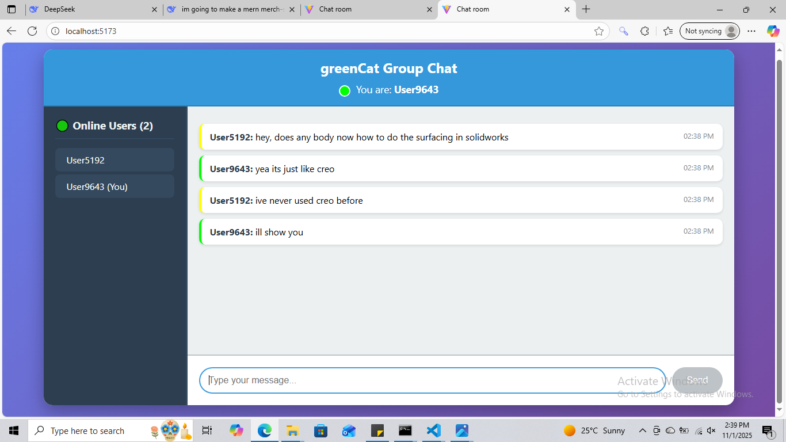

MERN Chat App
A real-time chat application built with the MERN stack and Socket.io. Messages appear instantly without refreshing.

What's Inside
Frontend: React, Socket.io client
Backend: Node.js, Express, MongoDB, Socket.io
Features: Live messaging, user auth, online status, message history
